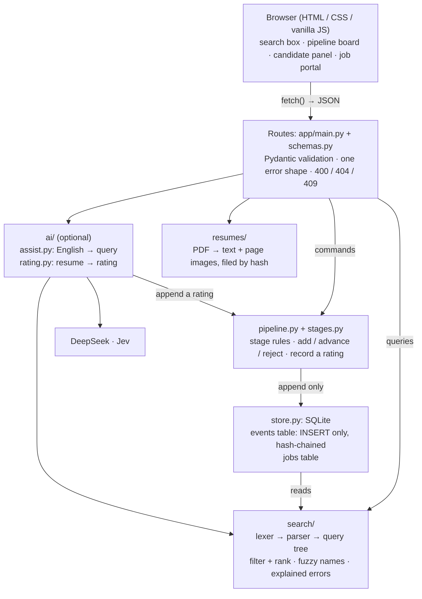
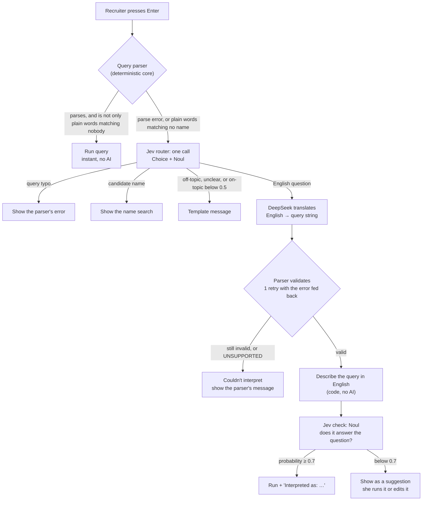
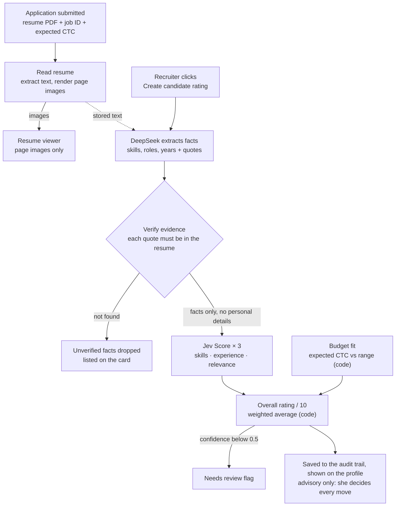

# Recruitly architecture

Recruitly helps a recruiter run a hiring pipeline. Candidates move through **Applied → Screening → Interview → Offer → Hired**, and can be rejected at any point before being hired. The portal shows everyone grouped by stage, keeps a history that can never be altered, and offers a single search box that handles typos, time-based filters and combined queries.

The core is built without AI. Every requirement is met with deterministic code, so it runs with no API keys and gives the same answer every time. An optional AI layer adds two features on top: asking search questions in plain English, and rating how well a candidate matches the job. With no API keys configured, the AI features are hidden and everything else works normally.

This document describes what is built. Where the build differs from the original design, the difference is listed at the end under [Changes from the original design](#changes-from-the-original-design).

## Contents

- [What the brief asks for](#what-the-brief-asks-for)
- [Tech stack](#tech-stack)
- [System architecture](#system-architecture)
- [API](#api)
- [Core components](#core-components)
- [The AI layer](#the-ai-layer)
- [Feature 1: ask in plain English](#feature-1-ask-in-plain-english)
- [Feature 2: candidate match rating](#feature-2-candidate-match-rating)
- [Guardrails](#guardrails)
- [Questions and thresholds](#questions-and-thresholds)
- [Failure handling](#failure-handling)
- [Privacy](#privacy)
- [Evaluation](#evaluation)
- [Project layout](#project-layout)
- [Configuration](#configuration)
- [Build order](#build-order)
- [Changes from the original design](#changes-from-the-original-design)

## What the brief asks for

| Area | Requirement |
| --- | --- |
| Pipeline | Add candidates; see everyone grouped by current stage |
| Pipeline | Move one stage at a time; no skipping; no reversing Hired or Rejected |
| Pipeline | Candidate view with full history and time in current stage |
| Audit | History is an audit trail: once recorded, never altered |
| Search | Typo-tolerant names ("sharam" finds Priya Sharma) |
| Search | Current stage; time in stage; entered stage since a date; reached a stage in the past; negation |
| Search | Combine filters; best matches first; explain invalid input instead of returning nothing |

## Tech stack

| Layer | Choice | Why |
| --- | --- | --- |
| Frontend | HTML, CSS, vanilla JavaScript | No framework or build step; nothing extra for reviewers to install |
| Backend | FastAPI (Python 3.11+), Uvicorn | Typed routes, automatic API docs, serves the frontend too |
| Validation | Pydantic | Ships with FastAPI; request and response models |
| Database | SQLite (built-in `sqlite3`) | Single file, zero setup; triggers enforce the audit rule |
| Resumes | pypdfium2, Pillow | Extract text and render page images from a PDF |
| AI (optional) | DeepSeek over its OpenAI-compatible HTTP API (`httpx2`); TypeSafe Python SDK (`typesafe-sdk`) for Jev | DeepSeek writes; Jev judges |

Running it:

```bash
python -m venv .venv
.venv\Scripts\python -m pip install -r requirements.txt
.venv\Scripts\python -m uvicorn app.main:app --reload
# open http://localhost:8000
```

## System architecture

The core modules (`stages`, `pipeline`, `store`, `search`) are plain Python with no FastAPI imports and no knowledge of the AI layer. Routes are a thin layer that validates input and calls them. The AI layer is one more set of modules that calls into the core: a translated query runs through the same parser as a typed one, and a rating is written through the same append-only path as every other event.



The FastAPI server also serves the frontend from `static/`.

## API

| Method | Endpoint | Purpose |
| --- | --- | --- |
| GET | `/api/candidates` | Board data: every candidate, current stage, time in stage |
| POST | `/api/candidates` | Add an application. Multipart: name, email, job ID, expected CTC (optional), resume PDF (required) |
| GET | `/api/candidates/{id}` | Stage, time in stage, job, resume details, rating, full history |
| POST | `/api/candidates/{id}/advance` | Move forward one stage `{expected_stage}` |
| POST | `/api/candidates/{id}/reject` | Reject `{expected_stage, reason}` |
| GET | `/api/candidates/{id}/resume/pages/{n}` | One rendered resume page image: the only way to view a resume |
| GET | `/api/candidates/{id}/rating` | Latest rating: categories, evidence, overall, confidence, status |
| POST | `/api/candidates/{id}/rating` | Create or re-run the rating (adds a new event). Returns 202; poll the GET until the status is no longer `pending` |
| GET | `/api/jobs` | Jobs and their requirements |
| GET | `/api/jobs/{id}` | One job, looked up by ID in any case |
| POST | `/api/jobs` | Add a job. Jobs can't be edited afterwards |
| GET | `/api/search?q=…` | Ranked results, or an explained error. Never uses AI |
| POST | `/api/assist` | Search that also accepts a plain-English question: path taken, interpreted query, description, results |
| GET | `/api/ai/status` | Which AI features are available (both keys configured?) |
| GET | `/api/audit/verify` | Checks the history hash chain is intact |
| POST | `/api/demo/seed` | Loads 14 demo candidates with backdated history and made-up resumes (empty pipeline only) |

There are deliberately **no** endpoints to edit or delete history. Errors share one shape so the frontend can display them directly:

```json
{ "error": "invalid_query",
  "message": "'stge' isn't a field. Did you mean 'stage'?",
  "position": 0 }
```

Status codes: `400` bad query or input · `404` unknown candidate or job · `409` a move the rules do not allow (for example "Already hired; final outcomes can't be changed." or "Priya Sharma is no longer in Screening; refresh and try again."), a duplicate application, or a duplicate job ID.

## Core components

### Pipeline rules: `stages.py`, `pipeline.py`

- Allowed moves: exactly one stage forward, or to Rejected from any stage before Hired.
- Hired and Rejected are final; any other move raises a clear error.
- Every move sends the stage the screen showed (`expected_stage`). If it is stale, the move is refused, so a double-click can never skip a stage. The check and the insert happen in one `BEGIN IMMEDIATE` transaction.
- An application needs a name, a valid email, an existing job ID and a resume. The same email can apply to different jobs, but not twice to the same one.
- Recording a rating appends a `rated` event and never changes the stage.

### Audit trail: `store.py`

- Nothing is edited in place. Every action (candidate added, advanced, rejected, rated) is a new row in an `events` table. A candidate's name, application, current stage, time in stage and latest rating are computed from these rows.
- The store exposes only append; SQLite triggers reject any `UPDATE` or `DELETE` on the table.
- Each row stores the SHA-256 hash of the previous row and its own hash, so hand-editing the database file is detected by `/api/audit/verify`.
- The application event records the resume's SHA-256 hash, so the resume a rating was based on can never be silently swapped.
- A separate `jobs` table holds job descriptions. It is reference data, prefilled with JOB-001 and extended from the Job portal page. Each rating event keeps its own copy of the requirements it was judged against.

### Search: `search/`

Bare words search names with typo tolerance; other terms are filters. Terms combine with spaces (AND), `OR`, `-` or `NOT` (negation), and parentheses.

| Recruiter's question | Query |
| --- | --- |
| Find Priya Sharma (typed "sharam") | `sharam` |
| Who's in Interview right now? | `stage:interview` |
| Stuck in Screening for more than a week | `stage:screening for:>7d` |
| Moved to Interview since Monday | `reached:interview>=monday` |
| Reached Offer but didn't get hired | `reached:offer -stage:hired` |
| Everyone except rejected candidates | `-stage:rejected` |
| Applicants for one job | `job:JOB-001` |
| Combined example | `(stage:interview OR stage:offer) priya` |

Fields: `stage:` (current stage; an unambiguous prefix such as `stage:int` is accepted), `for:` (time in current stage, with `>`, `>=`, `<`, `<=`), `reached:` (entered a stage, optionally compared with a date), `job:` (job applied for), `name:` (a name that looks like a keyword). Quoted phrases search each word as a name. Dates can be `today`, `yesterday`, a weekday (the most recent one, counting today), `DD-MM-YYYY` or `DD/MM/YYYY` (or `YYYY-MM-DD`), or how long ago (`3d`). Durations use `h`, `d` or `w`. "Monday" and "today" are resolved in IST.

- **Fuzzy matching:** optimal string alignment distance, which counts swapped adjacent letters as one typo, so "sharam" is one step from "sharma". Words of up to 3 letters must match exactly, 4 to 7 letters allow one typo, 8 or more allow two. Exact and prefix matches score highest.
- **Ranking:** name similarity first. For filter-only searches, the most relevant signal: the most recent move for a dated `reached:` filter, otherwise the longest time in the current stage.
- **Explained errors:** unknown fields and stages with suggestions, bad dates or durations with the position marked, contradictions (two stages at once: "Did you mean … OR …?"), unbalanced parentheses and quotes, and for empty results, which part of the query ruled everyone out.

### Frontend: `static/`

- **`index.html`:** search box, **Apply Filters** panel (dropdowns for name, job, current stage, excluded stage, time in stage and stage reached, which write a query into the search box), the pipeline board (one column per stage), ranked search results, the add-candidate dialog, and a slide-in candidate panel with the rating card, the job's requirements beside the candidate's details, the history timeline, the resume viewer, and only the valid actions.
- **`app.js`:** a small `api()` helper around `fetch` that turns error JSON into readable messages; renders the board, results and panel; debounced search as you type (never AI); `Enter` sends the text to `/api/assist`; polls the rating while it runs; re-fetches after every action.
- **`jobs.html`:** the Job portal, a plain sheet of jobs with an empty row at the bottom for adding one.
- **`styles.css`:** dark theme; board columns, cards, panel, rating card and sheet; works on smaller screens.

## The AI layer

The AI layer adds two features: asking search questions in plain English, and rating how well each candidate matches the job's requirements.

### The two models do different jobs

| | DeepSeek | Jev (TypeSafe) |
| --- | --- | --- |
| What it is | A text-generation LLM with an OpenAI-compatible API | A "System One" decision model. It cannot write text; it returns typed answers with probabilities |
| Output | Free text or JSON | Choice (one option from a list), Score (a position on an ordered rubric), or Noul (probability a statement is true) |
| Role in Recruitly | Translates English questions into query syntax; extracts facts from resumes | Routes search input, checks translations, rates candidates per category |
| Trusted? | Never directly; output is validated by our code | As a signal; our code decides what to do with it |

**Guiding rule: DeepSeek writes, Jev judges, and our code decides and enforces.** Policy (what is allowed, what gets recorded, how the overall rating is calculated) always lives in our code.

### Applications: job, requirements and resume

Rating a candidate needs something to rate against, so every application is linked to a job with defined requirements, and carries a resume.

**Job** (prefilled example: JOB-001; more are added on the Job portal page)

| Field | JOB-001 |
| --- | --- |
| Job ID and title | JOB-001 · Backend Engineer |
| Minimum experience | 3 years |
| Required skills | Python, FastAPI, SQL, REST API design |
| Nice-to-have skills | Docker, AWS, Redis |
| Budget (CTC per annum) | ₹18,00,000 to ₹26,00,000 (18 to 26 LPA) |
| Location / work mode | Lucknow · Hybrid |

**Application**

- Name, email, job ID applied for, expected CTC (optional; needed for the budget rating, since resumes rarely include it), and a resume PDF (required, up to 5 MB and 10 pages).
- The recruiter types the job ID; the portal fetches that job from the database and shows its requirements before saving.
- All recorded in the application (`added`) event, including the resume's SHA-256 hash.

**Read-only resume viewer**

- On upload, the server extracts the text (for AI) and renders each page to an image. The original PDF is stored outside the web folder, filed by its hash, and never served; the profile shows only the page images.
- There is no download link or file URL, and page images are sent with no-store headers. Dragging and the right-click menu are disabled on them.
- Honest limit: anything shown on screen can still be screenshotted. This prevents casual downloading, not determined copying.

### The candidate profile shows

- Pipeline stage, time in stage, and the valid actions.
- The match rating card (when AI is configured): a **Create candidate rating** button; then each category out of 5 with its weight and evidence, the overall rating out of 10, anything that was dropped, the model versions, and a "needs review" flag if Jev was unsure.
- The job applied for, with its requirements next to the candidate's matching facts.
- The full history.
- The resume viewer.

## Feature 1: ask in plain English

The recruiter can type a question like "who's been sitting in screening forever?" instead of `stage:screening for:>7d`. Typed queries and name searches still run instantly, as she types, with no AI.



If Jev or DeepSeek fails or times out at any point, she gets exactly what the plain search would have given: the parser's error or the name search.

### Step by step

- **When AI runs.** Only when she presses Enter and either the parser rejects the input, or the input is two or more plain words (no fields) that match no candidate. Bare words are valid name searches, so "sharam" and "priya sharma" never reach the AI; "who got hired last week" does. A sentence containing "or", "and" or "not" still counts as plain words, even though the parser reads those as operators.
- **Jev router.** One request asks two questions: a Choice (`query_typo`, `candidate_name`, `english_question`, `off_topic`, `unclear`) and a Noul (is this about candidates in a hiring pipeline?). The router takes the top answer; an on-topic probability below 0.5 overrides it to off-topic. DeepSeek is only called for English questions.
- **DeepSeek translation.** A fixed prompt describes the query language with examples and today's date, at temperature 0. It must return only a query string, or `UNSUPPORTED` if the question can't be expressed.
- **Validation.** Our parser checks the output. If invalid, DeepSeek gets one retry with the parser's error message; if it fails again, she is told it couldn't be interpreted, with the parser's explanation of her input.
- **Describe, then check.** Our code turns the query back into English ("Candidates who have been in Screening for more than 7 days"), and a Jev Noul checks it against her question.
- **Confidence decides the UI.** At or above 0.7, results show with "Interpreted as: …" and the query, which she can edit. Below, the query is offered as a suggestion she runs or edits.

## Feature 2: candidate match rating

Each application is rated against its job's requirements: three categories scored by Jev and one by code, each out of 5, and an overall rating out of 10. A rating runs when the recruiter clicks **Create candidate rating** on the profile; a spinner shows until it finishes, then the rating appears. It can be re-run. The rating is advice for the recruiter; it never moves a candidate.



### Who does what

- **DeepSeek extracts facts, not opinions.** From the resume text it returns structured JSON: skills found, past roles with dates, stated years of experience, each with a short quote from the resume as evidence. It does not rate anything. Invalid JSON gets one retry.
- **Our code verifies the evidence.** Every quote must actually appear in the resume text (ignoring case, spacing and typographic quotes). Facts without a matching quote are dropped, so an invented skill can't raise a rating. Our code also computes years of experience from the verified role dates, merging overlaps, so the number doesn't depend on a model's arithmetic.
- **Jev rates each category.** Jev's Score type rates a state against ordered rubric levels and returns a probability-weighted position with a confidence value; the code maps its five levels to 1 to 5. All three categories are asked in one request. Jev sees the job requirements and the verified facts only.
- **Budget fit is plain arithmetic.** Expected CTC against the budget range needs no AI.
- **Our code computes the overall rating.** A fixed, visible formula, not a model's opinion.

### Categories and rubrics (each out of 5)

| Category | Rated by | 1 | 2 | 3 | 4 | 5 |
| --- | --- | --- | --- | --- | --- | --- |
| Skills | Jev Score | None or only one of the required skills | Some required skills, but fewer than half | About half of the required skills | Most or all required skills, but few or none of the nice-to-haves | All required skills and at least some nice-to-haves |
| Experience | Jev Score | Less than half the required years, or no relevant experience | Below the minimum, but more than half of it | Within a few months of the minimum | More than the minimum in total, but only part of it directly relevant | Exceeds the minimum in directly relevant work |
| Role relevance | Jev Score | Unrelated field, or no roles | Loosely related: technical or adjacent work outside this field | Related field, different kind of role | Same kind of role, different domain or narrower scope | Same kind of role in a similar domain |
| Budget fit | Our code | More than 25% above the budget maximum | 10% to 25% above the maximum | Up to 10% above the maximum | Above the midpoint, within the budget | At or below the budget midpoint |

The full rubric wording lives in `app/ai/questions.py`. Levels 1, 3 and 5 follow the original design; levels 2 and 4 are drafted to sit between them.

### Overall rating out of 10

```
overall = 2 × (0.35·skills + 0.30·experience + 0.20·relevance + 0.15·budget)
# shown to one decimal, e.g. 7.4 / 10
# if a category can't be rated (e.g. no expected CTC), it is left out and the
# remaining weights are rescaled; the card says which category is missing
```

The weights are starting values, kept in `app/ai/weights.py` and shown on the rating card so the recruiter can see how the number was made.

## Guardrails

- **Jev never sees personal details.** No name, email, photo, age, gender, address, salary, resume text or quotes; only the job requirements and verified, job-relevant facts (skill names, role titles, organisations, dates and years). DeepSeek is instructed to extract nothing personal.
- **Advisory only.** A rating never advances, rejects or hires anyone. The board is not sorted by rating, and there is no rating filter.
- **Needs review.** If Jev's confidence on any category is below 0.5, the card says so instead of presenting a shaky number as certain.
- **Auditable.** Each rating is saved as an event with the model versions, the resume hash, the requirements used, the verified facts, the weights and the threshold. Re-rating adds a new event; old ratings are never overwritten. Failed attempts are recorded too.
- **Pinned model.** The Jev model version is pinned (`jev-1.13.0`) rather than using the moving `jev-latest` alias, so scores and confidence values don't shift between releases and thresholds stay valid.
- **Legal context.** Automated candidate scoring is regulated in some places (for example, New York City's bias-audit rules for automated hiring tools, and the EU AI Act's treatment of recruitment AI as high-risk). A production version would need a bias audit.

## Questions and thresholds

Following TypeSafe's guidance, every Jev question, option list, rubric and threshold lives in `app/ai/questions.py`, to be edited by hand. Question IDs are for our code and are not sent to the model.

| ID | Type | Question | How the answer is used |
| --- | --- | --- | --- |
| `input_kind` | Choice | What kind of input is the search text? Options: query with a typo, candidate name, question in English, off-topic, unclear | Top answer picks the path; no threshold |
| `on_topic` | Noul | Is the input an attempt to find or filter candidates in a hiring pipeline? | Below 0.5 → off-topic message |
| `translation_ok` | Noul | Would the described search return the candidates the recruiter asked for? | At or above 0.7 → run; else suggest (to be tuned with evals) |
| `skills_match` | Score | How well do the candidate's verified skills cover the job's required and nice-to-have skills? (5 levels) | Category score; confidence below 0.5 → needs review |
| `experience_match` | Score | How does the candidate's relevant experience compare with the job's minimum? (5 levels) | Category score; confidence below 0.5 → needs review |
| `role_relevance` | Score | How relevant are the candidate's past roles to this job? (5 levels) | Category score; confidence below 0.5 → needs review |

## Failure handling

| Situation | What the recruiter sees |
| --- | --- |
| No API keys configured | AI features hidden; resumes still viewable; the app works normally |
| Resume is a scanned image with no text | "Couldn't read text from this resume; rating unavailable"; the resume can still be viewed |
| DeepSeek returns invalid JSON twice, or doesn't answer | "Rating failed: …" with the **Create candidate rating** button to try again |
| Jev doesn't answer, or its reply is incomplete | "Rating failed: The scoring service did not answer." with the button to try again |
| No expected CTC given | Budget fit shown as "Not rated"; the overall uses the other categories |
| Jev unsure on a category | Score shown with a "needs review" flag |
| Search AI times out or errors | The normal parser error or name search for her input; the page never blocks |
| Low-confidence search translation | The query shown as a suggestion to run or edit |
| Question the query language can't express | "I couldn't turn that into a search." |

## Privacy

- Plain-English search sends only her question text (and today's date, and the English description of the translated query), never candidate records.
- Rating sends the resume text to DeepSeek for fact extraction; that text includes the candidate's personal details. Jev receives only the job requirements and verified, job-relevant facts, with no personal details.
- Original resume files stay on the server and are never served.

## Evaluation

- **Search eval** (`evals/search_eval.py`): 30 English questions with expected queries. A translation counts as correct when it finds the same candidates in the demo data as the expected query. Reports accuracy and how many were run automatically versus suggested.
- **Rating eval** (`evals/rating_eval.py`): the 14 made-up demo resumes with expected category scores, reported as agreement within ±1 point per category. The expected scores are a first draft to be reviewed by a person.
- **Fairness check:** the same resume rated under a different name must get the same rating. Because Jev never sees the name, this should hold by design; the rating eval checks it against the live models.
- **Consistency check:** rating the same resume twice should give the same result; checked by the rating eval.

The evals call the live models and have not been run yet.

## Project layout

```
Recruitly/
├── app/
│   ├── main.py            # FastAPI app, routes, serves static/
│   ├── schemas.py         # Pydantic request/response models
│   ├── config.py          # settings from the environment and .env
│   ├── stages.py          # stages + allowed moves
│   ├── pipeline.py        # add / advance / reject / record a rating
│   ├── store.py           # SQLite event store, hash chain, jobs table
│   ├── jobs.py            # Job type and the prefilled jobs
│   ├── seed.py            # demo candidates and their made-up resumes
│   ├── search/
│   │   ├── lexer.py
│   │   ├── parser.py
│   │   ├── evaluate.py    # filtering + ranking + empty-result explanations
│   │   └── fuzzy.py
│   ├── resumes/
│   │   ├── storage.py     # store PDF by hash, outside the web folder
│   │   ├── render.py      # extract text + render page images (pypdfium2)
│   │   └── simple_pdf.py  # writes the synthetic resume PDFs for the demo data and evals
│   └── ai/
│       ├── questions.py   # every Jev question, rubric and threshold
│       ├── weights.py     # overall-rating weights
│       ├── jev.py         # Jev client: router, translation check, category scores
│       ├── deepseek.py    # query translation + resume fact extraction
│       ├── evidence.py    # checks each extracted quote exists in the resume
│       ├── rating.py      # orchestrates the rating flow, computes the overall
│       ├── describe.py    # parsed query → plain English (no AI)
│       ├── assist.py      # orchestrates plain-English search
│       └── messages.py    # templates for off-topic / unclear / low confidence / rating status
├── static/
│   ├── index.html
│   ├── app.js
│   ├── styles.css
│   └── jobs.html          # the Job portal
├── evals/                 # search_eval.py, rating_eval.py: call the live models
├── docs/
│   └── ARCHITECTURE.md
├── requirements.txt
└── README.md
```

## Configuration

Settings are read from the environment, or from a `.env` file in the project root:

```
DEEPSEEK_API_KEY=                 # optional
DEEPSEEK_BASE_URL=https://api.deepseek.com
DEEPSEEK_MODEL=deepseek-chat
TYPESAFE_API_KEY=                 # optional; JEV_API_KEY is accepted too
JEV_MODEL=jev-1.13.0
# RECRUITLY_AI=off                # disable the AI layer even when keys are present
```

Both keys are needed for either AI feature. `RECRUITLY_DB` sets the database path (default `data/recruitly.db`); resumes are stored in a `resumes` folder beside it.

## Build order

| Step | Work | Done when | Status |
| --- | --- | --- | --- |
| 1 | Stages, pipeline rules, event store | Stage rules enforced; tampering detected | Done |
| 2 | Search engine | All six brief examples work, errors explained | Done |
| 3 | FastAPI routes + demo seed | Endpoints work; docs visible at `/docs` | Done |
| 4 | Frontend | Board, search and candidate panel work end to end | Done |
| 5 | Jobs, application fields, resume storage and read-only viewer | Upload, viewer and job lookup work without AI | Done |
| 6 | `questions.py` and `weights.py`, with hand-edited wording | First draft written; hand editing pending | Drafted |
| 7 | Rating: fact extraction, evidence check, Jev scores, overall; profile rating card | Rating card works end to end | Done; not yet run against the live models |
| 8 | Plain-English search: router, translation, check, `/api/assist`, UI | Every path in the flow works | Done; not yet run against the live models |
| 9 | Evals (search, rating, fairness, consistency); record results in the README | Results recorded | Written; not yet run |
| 10 | README | How to run, decisions, limits and roadmap documented | Done |

## Changes from the original design

| Original design | What was built, and why |
| --- | --- |
| Ratings run automatically when a candidate is added | Ratings run when the recruiter clicks **Create candidate rating**, with a spinner until done. Requested so the recruiter decides when models are called |
| Jobs are seeded only | A jobs table prefilled with JOB-001, plus a Job portal page for adding jobs (add only, no editing) |
| The search language gains `rating:` and `job:` filters | Only `job:` was added, also as a Job dropdown in Apply Filters. There is no filtering on ratings |
| The router's Choice runs only after the parser rejects input or words match no name | Same, plus sentences containing "or", "and" or "not" count as plain words, so they reach the AI instead of being read as operators |
| DeepSeek returns only a query string | Same, plus it may return `UNSUPPORTED` when the query language can't express the question |
| Jev's key named `TYPESAFE_API_KEY` | `JEV_API_KEY` is accepted as well |
| Years of experience come from DeepSeek | Also computed in code from the verified role dates, and both are shown |
| Only successful ratings are saved | Failed attempts are recorded as well, so "Rating failed" survives a restart |
